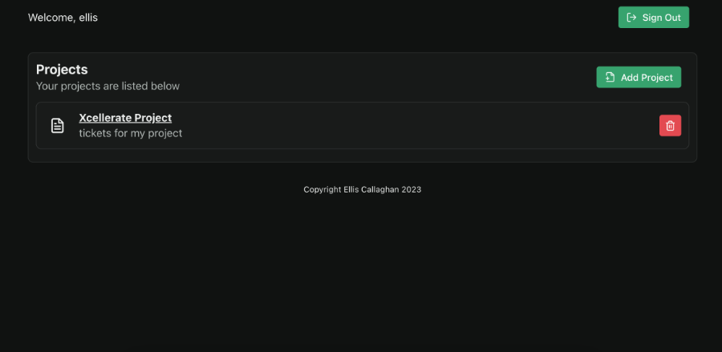
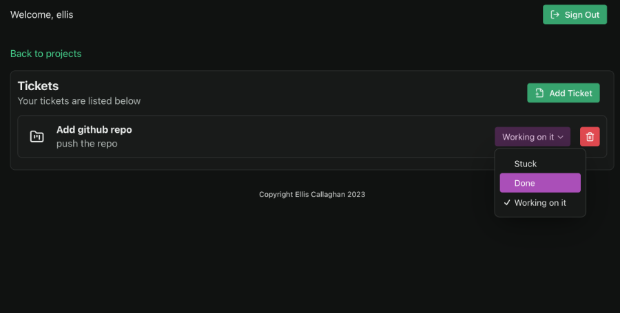
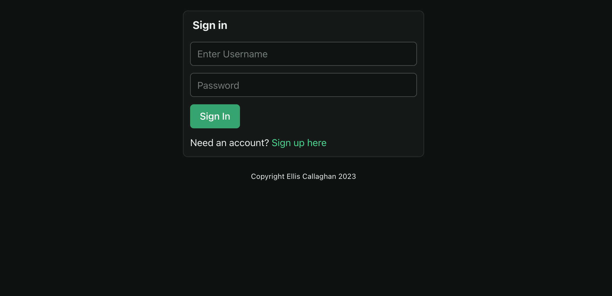

# Capstone Project - Project Management Application

My final project for the Xcellerate Full-Stack Immersive Course 2023. It demonstrates my skills in full-stack development using React.

The project uses Next.js a React.js framework

## Features

- **User Authentication:** Login and Signup, Logout (Hashed password authentication.)
- **Project Management:** Ability to add and delete projects
- **Ticket Management:** Ability to add and delete tickets
- **Online SQL database:** Uses Turso (https://turso.tech) a modern SQL database for storing projects and tickets
- **Profesional UI/UX Design:** Using a Modern UI design library for React.

## Prerequisite

```bash
# Create a database at Turso.tech.
$ Turso.tech

# Add database URL and Auth Token from Turso in .env (you can rename .env-example)
$ DATABASE_URL = "libsql://....."
$ DATABASE_AUTH_TOKEN = "...."
```

## Build Setup

```bash
# Install dependencies
$ pnpm install

# Generate database migrations
$ pnpm run generate

# Create the databae tables
$ pnpm run push

# Serve with hot reload at localhost:3000
$ pnpm run dev
```

## Screenshots




